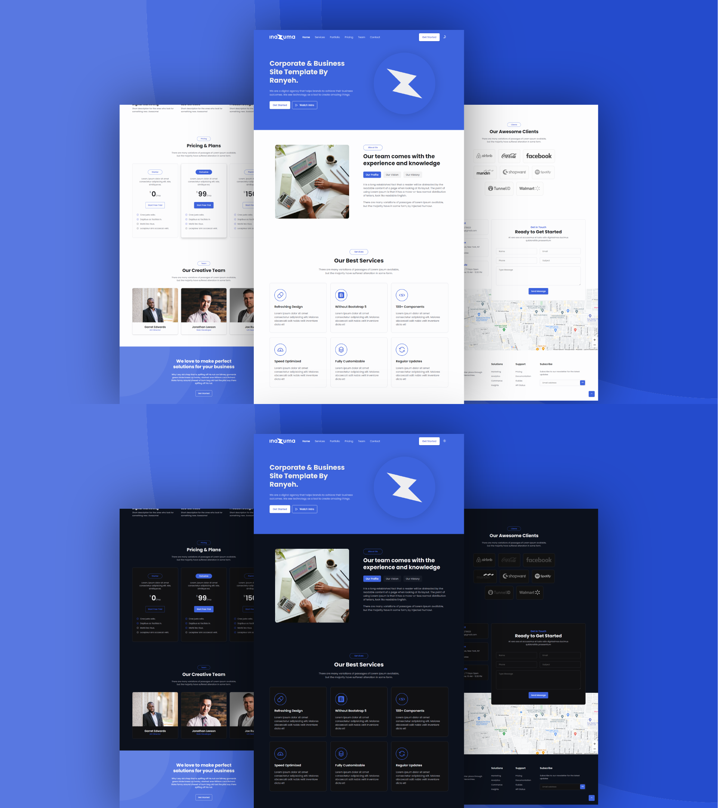

# Inazuma - HTML Template for Corporate and Business

A responsive landing page for a business company. Built to practice my HTML, CSS and JavaScript skills.

## Description

Inazuma is an open-source HTML template created for corporate and business company. This template is a clone of [Business | Bootstrap 5 Business Template](https://demo.ayroui.com/templates/business-template/) I found on the internet, but without any framework and slight adjustments to the design. It's just personal project for personal portfolio. 

## Features

* Responsive navbar with CTA and switch theme buttons
* Hero section with CTA and intro video buttons
* Smooth scrolling in each section
* Includes a dark & light theme
* Video section showcasing intro video
* Responsive footer
* SEO-Friendly
* Compatible to all browsers

## Technologies Used

* HTML
* CSS
* JavaScript

## Plugins Used

* [ScrollReveal](https://scrollrevealjs.org/)
* [GLightbox](https://biati-digital.github.io/glightbox/)
* [Lineicons](https://lineicons.com/)

## Preview



## Live Demo

You can see the live demo [here](https://ranyeh24.github.io/inazuma/).

## Installation

1. Clone the repository:
```
git clone https://github.com/yourusername/inazuma.git
```
2. Or you can download the zip then extract it to your project folder.
3. Open `index.html` in your web browser.

## Usage

This project is a static website. You can use it as a template or reference for building similar landing pages or to practice your HTML, CSS and JavaScript skills.

## Customization

* To change colors, modify the color variables in CSS file.
* To set animations when scrolling (unset by default), see the [Set Animations When Scrolling](#set-animations-when-scrolling) section.
* To change fonts, update the Google Fonts link and modify the `--font-family` variable in the CSS file.

## Responsive Design

The template is responsive and adapts to different screen sizes:

* Desktop view (> 992px)
* Tablet view (576 - 992px)
* Mobile view (< 576px)

## Learning Outcomes

This project help practice:

* HTML structure and semantic tags
* CSS layout techniques (flexbox and grid)
* Responsive design principles
* Creating cohesive color scheme and typography

## Set Animations When Scrolling

Here are the steps to set animations when scrolling:

* Open `main.js` file inside `assets/js` folder.
* Look for the line of code that controls animations when scrolling in code line number 138 to 147.
* Delete the `//` signs in each line of code to uncomment the code so that the code can be run.
* Then, save the code and run it in your web browser.

You can follow these steps to set animations when scrolling, or you can set it up with another animation plugins. It's up to you!

## Bugs and Issues

Have a bug or an issue with this template? [Open a new issue](https://github.com/ranyeh24/inazuma/issues) here on GitHub or email me at <real.ranyeh24@gmail.com>.

## Credits
* Template design from [Business | Bootstrap 5 Business Template](https://demo.ayroui.com/templates/business-template/)
* Images from [Unsplash](https://unsplash.com/)

## License

Inazuma is open-source and available under the [MIT License](https://raw.githubusercontent.com/ranyeh24/inazuma/main/LICENSE). You can use it with your personal or commercial projects without any attribution or backlink.
