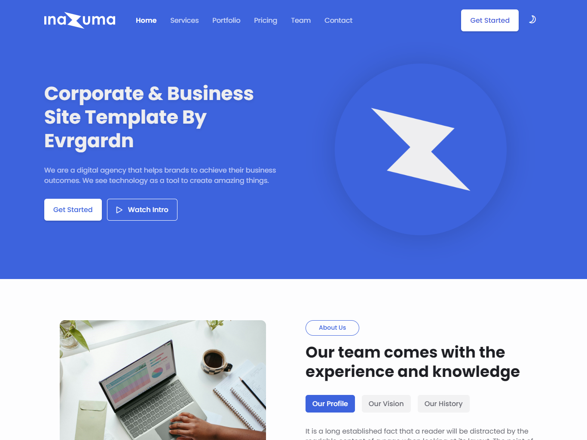

# Inazuma | Corporate & Business Website Template

This is an open source corporate and business website template created by [Ranyeh](https://www.github.com/ranyeh24).

To begin using this template, just extract the zipped files in any folder you want and run it.

* This template designed using HTML, CSS, and JavaScript.
* Can contains animation when scrolling (none by default).
* Smooth scrolling in each section.
* Includes a dark & light theme.
* Developed first with the desktop size, then for mobile.
* Compatible with all mobile devices and with a beautiful and pleasant user interface.

## Previews

Here are previews for Light Mode and Dark Mode.

### Light Mode

### Dark Mode

## Notes

Here are the steps to set up animations when scrolling:

* Open `main.js` file in assets/js folder
* Look for the line of code that controls animations when scrolling in code line number 138 to 147
* Delete the `//` sign in each line of code to be able to run the code
* After that, save the code and run it in your browser

By default, the JavaScript file that is executed is `main.min.js`. This file is a minified version of `main.js`. You can only use one of the files you want to run on your website. If you want to use the minified version, make sure the code changes have also been implemented in the minified version.

## Bugs and Issues

Have a bug or an issue with this template? Email me at real.ranyeh24@gmail.com.

## Authors

This template is created and developed by [@ranyeh24](https://www.github.com/ranyeh24).
